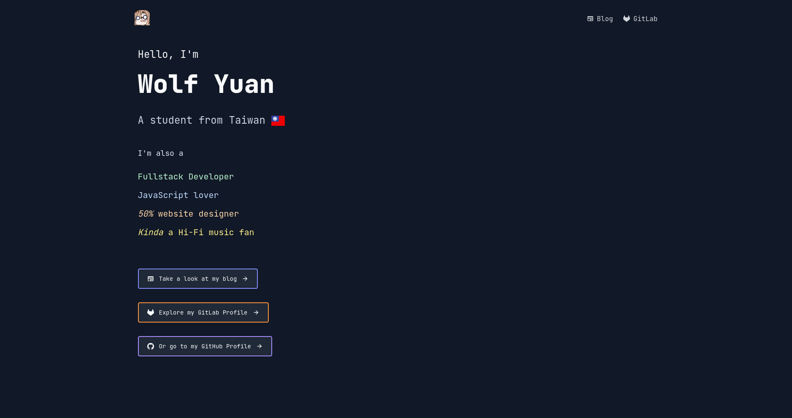

# 🏠 [Homepage](https://wolf-yuan.dev)



This repository contains the source code for my personal website. The website is built using Astro, a blazing-fast static site framework, with mdx as the markdown renderer, TailwindCSS for styling.

## 🛠️ Techonologies

- [**Astro**](https://astro.build): A modern front-end framework for building fast, optimized websites.
- [**Tailwind CSS**](https://tailwindcss.com/): A utility-first CSS framework for rapidly building custom designs.
- [**MDX**](https://mdxjs.com/): A markdown parser that allows you to write JSX in your markdown files.
- [**Cloudflare Pages**](https://pages.cloudflare.com/): A platform that provides streamlined collaborative development and easy deployment for web projects.

## 📁 Directory Structure

- `src/` - contains all the source code for the website.
  - `assets/` - contains all the assets used in the website.
    - `blog/` - contains all the images used in the blog posts.
  - `components/` - contains all the Astro components used in the website.
  - `content/` - contains all the markdown files for the blog posts.
    - `en/` - contains all the English blog posts.
    - `zh/` - contains all the Chinese Traditional blog posts.
  - `i18n/` - contains some translations for the website.
  - `layouts/` - contains the layout components for the website.
  - `pages/` - contains all the pages for the website.
    - `blog/` - contains the blog index page and the blog post page.
    - `zh-tw/` - contains the Chinese Traditional clone of the website.

## 🏗️ Building

Ez, just run:

```bash
pnpm install
```

then

```bash
pnpm build
```

## 🖥️ Developing

> Note that this source code is barely readable for someone who is not ME. I'm working on making it more readable for others, if you have any question, feel free to send an email to me.

Just start development server:

```bash
pnpm dev
```

## 🍴 Forking

Feel free to fork this repository. Keep in mind you must follow the license, you can check the `LICENSE` file.
