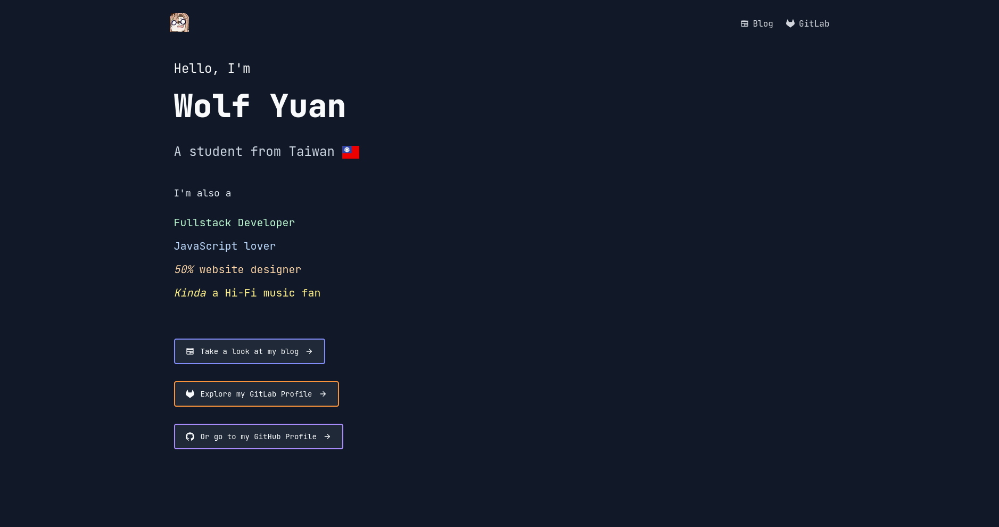

# 🏠 [Homepage](https://wolf-yuan.dev)



This repository contains the source code for my personal website. The website is built using Astro, a blazing-fast static site framework, with mdx as the markdown renderer, TailwindCSS for styling.

## 🛠️ Technologies

- [**Astro**](https://astro.build): A modern front-end framework for building fast, optimized websites.
- [**Tailwind CSS**](https://tailwindcss.com/): A utility-first CSS framework for rapidly building custom designs.
- [**MDX**](https://mdxjs.com/): A markdown parser that allows you to write JSX in your markdown files.
- [**Sätteri**](https://satteri.bruits.org/): Astro's native Markdown processor, used here for typed MDX syntax-tree transformations.
- [**Cloudflare Pages**](https://pages.cloudflare.com/): A platform that provides streamlined collaborative development and easy deployment for web projects.

## 📁 Directory Structure

- `src/` - contains all the source code for the website.
  - `assets/` - contains all the assets used in the website.
    - `blog/` - contains all the images used in the blog posts.
  - `components/` - contains all the Astro components used in the website.
    - `pages/` - contains the shared page views used by locale route adapters.
  - `content/` - contains all the markdown files for the blog posts.
    - `en/` - contains all the English blog posts.
    - `zh-tw/` - contains all the Traditional Chinese blog posts.
  - `i18n/` - contains typed locale configuration and interface messages.
  - `layouts/` - contains the layout components for the website.
  - `lib/` - contains shared typed helpers for blog content and RSS feeds.
  - `plugins/` - contains native Sätteri HAST transformations for MDX output.
  - `pages/` - contains all the pages for the website.
    - `blog/` - contains the blog index page and the blog post page.
    - `zh-tw/` - contains the Traditional Chinese route adapters.

## 🏗️ Building

Install the pinned dependencies with Bun:

```bash
bun install --frozen-lockfile
```

Then create a production build:

```bash
bun run build
```

Run formatting, type checking, unit tests, the production build, and output tests together with `bun run verify`.

## 🖥️ Developing

Just start development server:

```bash
bun run dev
```

## 🍴 Forking

Feel free to fork this repository. Keep in mind you must follow the license, you can check the `LICENSE` file.
