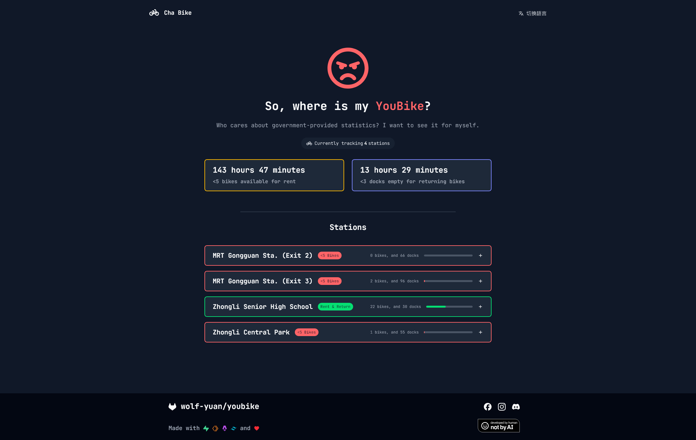
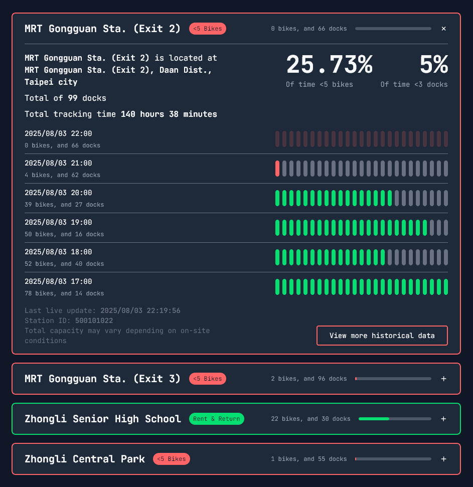
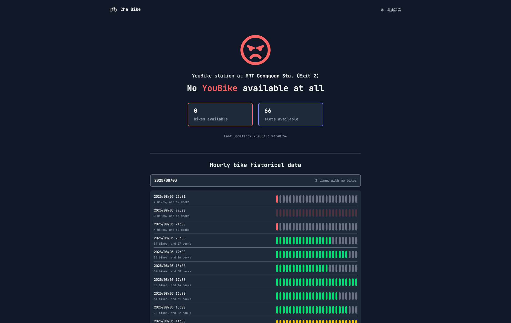
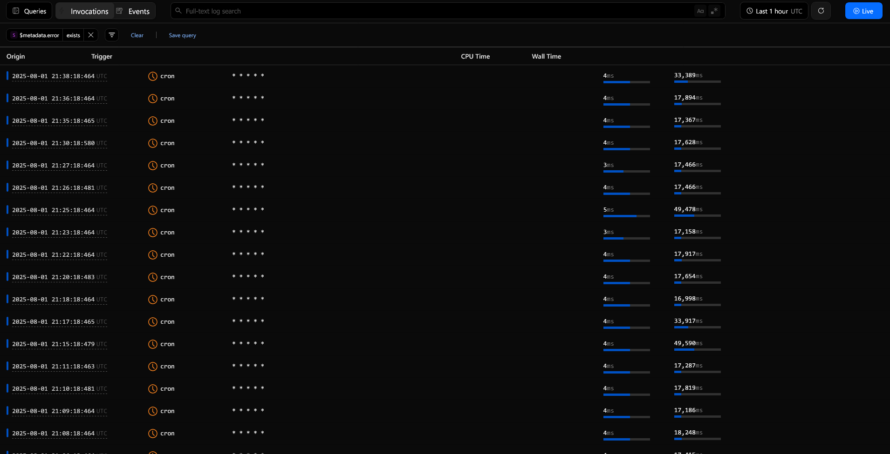

> [Take me to the Bike Tracker Website directly](https://youbike.wolf-yuan.dev/)

> *This project isn’t related to YouBike in any way*

Lately, YouBike has been driving me crazy

Like, isn’t the whole point of YouBike to make sure every station *has bikes to borrow* and *space to return*? But it feels like they’re not even trying to improve the situation.

After getting stuck a few times, either no bikes after school or no empty docks when I finally get somewhere. I eventually just gave up calling their customer service. I swear, calling from my phone started costing real money

So I decided to write a *little* program to check if YouBike actually does anything when a station runs out, or if they even try to prevent this from happening during peak hour.

## Cha Bike

> Wonder what Cha Bike means? The Cha, refers to `查`(Chá) in Chinese, meaning to check and query something

After like 25 hours of hardcore coding (plus a few days, I mean weeks, collecting data), I made this site:

You can check it out here: https://youbike.wolf-yuan.dev

### A homepage that's straightforward

At the top, you’ll see how many stations are being tracked, plus how many total hours bikes were all gone or docks were all full.

There’s also a massive emoji and a text describes the overall status.

What the emojis mean:

- Green smiley face: All stations are fine—you can borrow and return
- Yellow crying face: Some stations are full—no place to return bikes
- Red fury face: Some stations are empty—no bikes to borrow

Each station card can be expanded to show recent history, and the percentage of time the station has no bikes or no docks for bikes to return:

### Detailed Station Page

Click "View more historical data" and you’ll get to this page:

It shows **up to 5 days** of hourly data and the **real-time** status. On the side, there’s a little status bar showing the condition at that hour.

The same colors apply:

- Yellow: no docks to return
- Red: no bikes to borrow

But the emoji on this page works slightly differently:

- Red: **Completely out** of bikes or docks
- Yellow: Less than five bikes or fewer than three docks
- Green: All good, nothing to worry

> Might change later, but for now I think this is the clearest way to show what’s going on

### Can I Add My Station?

Yeah yeah, cool features and all—but how do *you* get your station on the site?

Right now it’s **by request only**, since the server might still explode.
If you want to add a station near your house or school, email [me@wolf-yuan.dev](mailto:me@wolf-yuan.dev?subject=Add%20Station%20to%20ChaBike) with this info:

1. The **full name** of the station
   > You can find this on the dock name or the official YouBike site. If you're not sure, just send the address. Make sure the name is unique!
2. One or more **photos** showing the station is either out of bikes or full
   > If you don’t have photos, write a short explanation why you want it added

Due to limitation on server space and compute resources, we cannot track every station in Taiwan. This is just how it has to work for now.

## Tech Stuff 🤓☝️

Alright, nerd time :D. How does the website work?

The whole thing lives in the cloud and currently doesn't cost me a penny.

> Please don’t DDoS me though 🙏 I *might* open up an API in the future.

### The Backend (aka data grabber)

Backend is written in **TypeScript**, runs on **Cloudflare Workers**, and pulls data from YouBike’s web API, saving it to **Supabase** database.

There are two types of data, both collected using **cron trigger** on Workers:

- Every minute `* * * * *`: grabs real-time status to count how long stations have been empty / full
- Every hour `0 * * * *`: takes a snapshot of all station statuses

Hourly snapshots are kept for 5 days. The minute-by-minute stats don’t expire—they just keep adding up.

### The Frontend

Frontend uses **Astro** + **TypeScript** + **TailwindCSS**, and also runs on **Cloudflare Workers**.

Pages are SSR (server side rendered), so there’s no extra API fetching on the client side. That means it works faster, especially on slower phones made out of potato.

The website design is the same as my personal site. Page transitions are powered by Astro’s `<ClientRouter />` and the [View Transition API](https://developer.mozilla.org/en-US/docs/Web/API/View_Transition_API) for smooth animations.

> Sorry Firefox users... this API isn’t supported yet, so you will get normal fade-in fade-out transitions

### YouBike’s Server is made out of potato

By the way. YouBike’s backend is... really just made out of potato.

Sometimes I get a ton of 503 errors when pulling data, usually late at night. I don’t know if it’s on purpose or just bad backend code, but it’s super annoying.

My guess is they’re trying to save money and scale down their servers or database at night. And the error rate just climbs up.

## So, what does the data tell?

After looking at the data, here’s my conclusion:

Yes, YouBike *can* fix the no-bike / no-dock problem. And I think they *want* to fix it. But honestly? They need to work harder.

According to [Taipei's bike availability data](https://data.taipei/dataset/detail?id=ba0dafae-043c-4730-b97e-2defd7af766c), there are 700+ stations with >90% availability, and 500+ between 60–90%.

My collected data kinda lines up with it. But some small or low-usage stations make the data look better than they really are.
Like seriously, if a station runs out of bikes during peak hour, **that’s not 93% availability** for station like this.

Also, after you call customer service, it takes around **15 minutes** to restock a station, if they even have bikes ready. If not, they’ll just tell you to walk to another station, or you'll wait more than 30 minutes to just have bikes to ride.

In Taipei or New Taipei, you can probably take the MRT. But in other places? The next station might be crazily far. You might as well take a bus or just walk instead.

Oh, and YouBike? They removed the “no bikes to rent” option from their hotline options. That's just **perfect**
