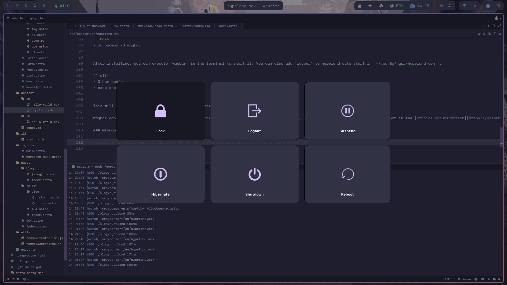
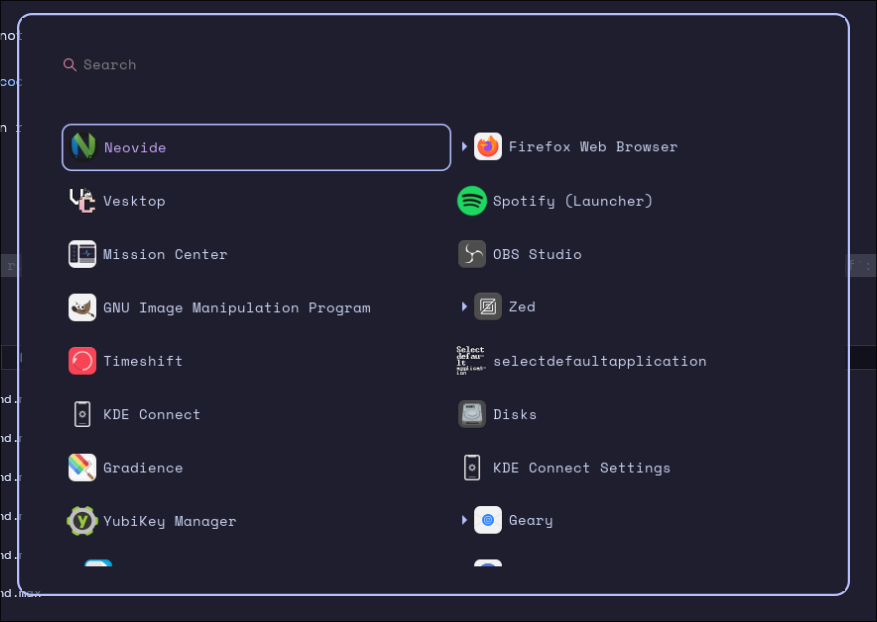

> 嘿，如果你看得懂這段文字，那麼恭喜你，這篇文章有中文版本，你可以點頁尾的翻譯圖示或是到[這裡](/zh-tw/blog/hyprland/)。

One day, I was browsing the internet, and I found a couple news posts about a new window manager called hyprland, which is based on Wayland.

There is already plenty of posts on Reddit (mainly `r/unixporn`, cool place to check out btw) showing off their beautiful desktop that doesn't looks like traditional desktops like Gnome or KDE, which is a thing I've trying to do for years.

After digging through some documentation and videos, I decided to give it a try. I will share how I installed and configured hyprland on my computer in this post.

Oh btw, here's how it looks like right now:


## Installation

Installation is very simple, you only need to install bare metal Arch Linux (Without any desktop environment) and run the following command:

> Hey, if you are brave enough you can also install NixOS, but I choose not to do so :)
>
> Friendly reminder: You probably don't want to use NixOS cuz it's a pain, at least for me.

```bash
sudo pacman -S hyprland
```

You might also need `kitty` terminal emulator, because hyprland uses `kitty` as the default terminal emulator in its default configuration. You can install it by running:

```bash
sudo pacman -S kitty
```

Well, isn't that simple? Note that I still recommend to use Arch Linux as the base system, but using Arch based distro like Manjaro or EndeavourOS will work too.

> This blog posts will **assume you're using Arch Linux as the base system.**
>
> Note that I don't recommended to use Debian or Fedora, they don't update as fast as Arch Linux does.
>
> You can still use it if you want to, but some additional components needed by hyprland or required to make hyprland better might not exists in their software repositories. You probably need to **compile them by yourself**.

After installing hyprland, you may also need a login manager if you don't want to type `hyprland` under tty to start desktop everytime you start your PC.
I use `sddm` because it's simple and customizable. You can install it by running:

```bash
sudo pacman -S sddm
```

After a quick reboot, Voilà! You successfully installed hyprland with sddm as display manager on your computer.

## Customization

Oh wait, you got a destop that's not even close beautiful? Due to hyprland ships with a bare minimum, auto generated configuration, you need to configure everything from ground up. For example following key binding are not working by default:

- Brightness control
- Volume control
- Screenshot

Not to mention there is not a lock screen by default, you see what the *hightly customizable* here? Hyprland doesn't configure everything for you out of the box, you need to do everything by yourself.

I first remove the auto generated config warning banner appeared on the top of the screen:

Open `~/.config/hypr/hyprland.conf`, and comment following line starts with `autogenerated`:

```ini
# #######################################################################################
# AUTOGENERATED HYPR CONFIG.
# PLEASE USE THE CONFIG PROVIDED IN THE GIT REPO /examples/hypr.conf AND EDIT IT,
# OR EDIT THIS ONE ACCORDING TO THE WIKI INSTRUCTIONS.
# #######################################################################################

autogenerated = 1 # remove this line to remove the warning // [!code focus] // [!code --]
# autogenerated = 1 # remove this line to remove the warning // [!code focus]
```

The small warning banner will disappear after you save the file. Hyprland will reload config file as soon as it detects changes in the config file. You can also trigger config reload by typing `hyprctl reload` in the terminal.

Hyprland has it's own config file documentation, you can find all all available options in the [official wiki](https://wiki.hyprland.org/Configuring/Variables/).

## Adding extra spice to hyprland

Hyprland doesn't have a lot of features like other window managers or desktop environments out of the box. But you can add extra features to Hyprland by installing additional software.

I will mention several things that I added to my hyprland setup to make it more usable (also more beautiful):

### waybar

[waybar](https://github.com/Alexays/Waybar) is a status bar for Wayland. It can be customized with Waybar's config file and GTK CSS.


To install waybar, you can run:

```bash
sudo pacman -S waybar
```

After installing, you can execute `waybar` in the terminal to start it. You can also let `waybar` to hyprland auto start in `~/.config/hypr/hyprland.conf`:

```diff
# Other config ...
+ exec-once = waybar
```

This will start `waybar` automatically when you start Hyprland.

waybar can be customized by editing `~/.config/waybar/config` and `~/.config/waybar/style.css`, you can find more information about Waybar in the [official documentation](https://github.com/Alexays/Waybar/wiki)

### wlogout

[wlogout](https://github.com/ArtsyMacaw/wlogout) is a logout menu that also uses Wayland. It can be used to logout, reboot, shutdown, lock the screen or execute other commands.



To install wlogout, you can run:

```bash
paru -S wlogout
```

> `wlogout` is in [AUR](https://aur.archlinux.org/packages/wlogout). You can replace `paru` with `yay` or any other AUR helper you prefer.

wlogout has some options that can be configured in `~/.config/wlogout/layout` and `~/.config/wlogout/style.css`. You can check it out available options using `man 5 wlogout`.

Unlike `waybar` which needs to be started when hyprland starts, `wlogout` can be bind to a keybind in `~/.config/hypr/hyprland.conf`:

```diff
+ bind = SUPER, P, exec, wlogout
```

This will open `wlogout` when pressed `SUPER (Normally Windows key) + P` key combination.

### wofi

> Note that wofi seems not being actively maintained anymore, but it still works fine on my setup. If you mind that, check out some alternatives like [fuzzel](https://codeberg.org/dnkl/fuzzel) or [rofi](https://github.com/davatorium/rofi)

[wofi](https://sr.ht/~scoopta/wofi/) is a wayland based application launcher / menu. It also supports custom GTK CSS.



To install wofi, you can run:

```bash
sudo pacman -S wofi
```

You can start wofi by running `wofi` in the terminal. You can also bind `wofi --show drun` to a keybind in `~/.config/hypr/hyprland.conf`:

```diff
+ bind = SUPER, D, exec, wofi --show drun
```

> To show application icon in wofi, add `--allow-images` to the command line options.

### SwayOSD

[SwayOSD](https://github.com/ErikReider/SwayOSD) is a cool OSD that will show volume and brightness changes, also optional Caps Lock key and Num Lock key status changes.

To install SwayOSD, you can run:

```bash
paru -S swayosd-git
```

Make `swayosd-server` start when you logged into hyprland:

```diff
+ exec-once = swayosd-server
```

And bind volume button, brightness button to SwayOSD in `~/.config/hypr/hyprland.conf`:

```diff
+ bindl = ,XF86AudioMute, exec, swayosd-client --output-volume mute-toggle
+ bindle =, XF86AudioRaiseVolume, exec, swayosd-client --output-volume raise
+ bindle =, XF86AudioLowerVolume, exec, swayosd-client --output-volume lower
+ bindle =, XF86MonBrightnessUp, exec, swayosd-client --brightness +3
+ bindle =, XF86MonBrightnessDown, exec, swayosd-client --brightness -3
```

This will let swayosd to show OSD when press volume or brightness button on your keyboard.

> `swayosd-git` is in [AUR](https://aur.archlinux.org/packages/swayosd-git). You can replace `paru` with `yay` or any other AUR helper you prefer.
>
> As the time I write this post, SwayOSD does not has a tagged AUR package, there is only `-git` version available.

## Why wayland matters when choosing hyprland widgets?

Hyprland, is based on Wayland protocol, which is a new display server protocol that is more secure and modern than X11. As result, legacy X11 applications is not supported nativly on Wayland.

Thought it's possible to run X11 applications on Wayland using XWayland, but it's not recommended because most of time it's slower and has plenty of visual bugs (HiDPI scaling, weird border etc.).

When you choose widgets for hyprland, make sure they are based on Wayland protocol (like ones made for wlroots), so they can run natively on hyprland without any issues.

## My dot files

There is a repository on GitLab with some of my dot files, including my hyprland configuration. You can check it out [here](https://gitlab.com/wolf-yuan/dotfiles).

## Conclusion

This represents my perspective on hyprland, and I hope this article has helped you understand hyprland and provided you with some ideas on how to use it. If you have any questions or suggestions, feel free to send me an email - you can find my email address on my website's homepage.
