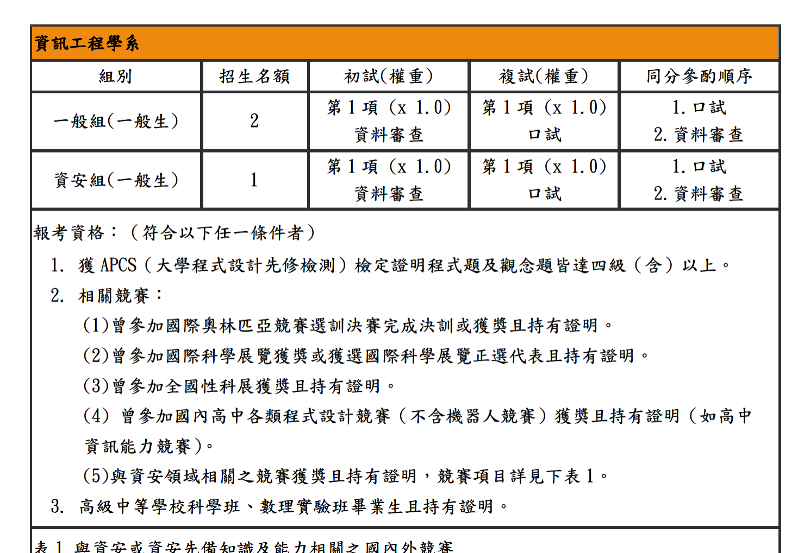
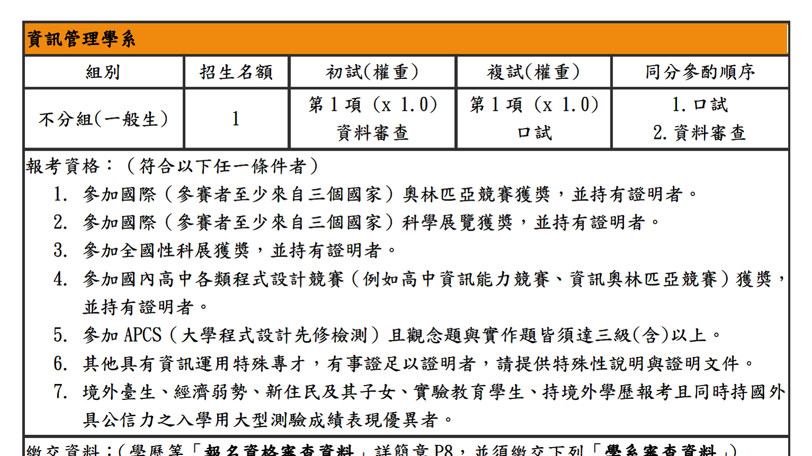

> Basically just a late reflection on Special Recruitment.

## Results first

Since results seem to be the most important thing in Asian society, let's show the results first.

| School | Department | Result | 
| :---: | :---: | :---: |
| National Cheng Kung University | CSIE | **Accepted (Rank 1)** |
| National Central University | *Information Management* | **Accepted (Rank 1)** |
| Chung Yuan Christian University | CSIE | **Accepted (Rank 2)** |
| National Tsing Hua University | CSIE | Failed stage 1 😭 |
| National Yang Ming Chiao Tung University | CSIE | Failed stage 1 😭 |
| National Sun Yat-sen University | CSIE | Failed stage 1 😭 |
| National University of Tainan | CSIE | Passed stage 1, withdrew |
| National University of Kaohsiung | CSIE | Passed stage 1, withdrew | 
| National Taiwan Ocean University | CSIE | Passed stage 1, withdrew |
| National Kaohsiung Normal University | *Software Engineering and Management* | Passed stage 1, withdrew |

I eventually chose to go to NCKU. As for why I withdrew from so many schools after passing the first stage, I'll explain below.

## What experience do I have?

Simply put, I'm the type of people who just simply make a lot of projects.

I don't like competitive programming (Like LeetCode). My APCS scores were only Level 3 for both Concept and Implementation. I didn't get into the Turing Program or anything like that.

Instead, I did a lot of projects. Besides this website, I've worked on other projects, currently focusing on web development and develop small tools.

What's a bit different now is that I understand some hardware stuff, like circuit boards. I've designed and made two or three PCBs by myself (Um through JLCPCB actually).

I've also participated in a few hackathons, though I didn't win any awards. I've actually organized or helped prepare more hackathons than I've participated in.

> *Hackathon extended reading: [HackIt HackIt might have some problems](/en/blog/hackit-problem)*

> Portfolio public version download: [Click here](https://barn.wolf-yuan.dev/srecuit%20public.pdf)
>
> The portfolio file is quite large, so it might lag a bit.

## National Central University interview

> National Central University is referred to as **NCU** below.

NCU was ahead of schedule compared to all other schools. It was the earliest to **stop application**, interview, and announce results. If I remember correctly, registration started in October, including writing invitation letters.

> By the way, I personally think that unless you can find someone very special, just asking a teacher at school who knows you well to write the recommendation letter is fine.

However, after NCU released the brochure, I found that I didn't meet the qualifications for the NCU CSIE department:

> Translation: "I. Applicants must have achieved Level 4 or above in both the Concept and Implementation sections of the APCS exam."

Oh no, APCS blocked me. So... let's go to Information Management (Referred as IM below). The conditions for IM were relatively friendlier (?), and my APCS score just met the requirement. It looked something like this:

> Translation: "I. Applicants must have achieved Level 3 or above in both the Concept and Implementation sections of the APCS exam."

> I personally think both IM and CSIE are fine, as they are both information-related.
> 
> However, according to some seniors from previous years, NCU IM leans heavily towards management rather than information enginnering. If future juniors who like tech want to apply for IM Special Recruitment, you should understand the actual situation.

NCU announced the first-stage list quite quickly, and unsurprisingly, I made it to the second stage. NCU's second stage is actually very similar to the "Individual Application" admission channel, which is the method used by most schools—an interview.

I forgot the detailed content of the interview, but I remember there were four or five professors, though only two or three asked questions. I brought a tri-fold resume to this interview, and the professors took it. Maybe they thought it was special, I don't know.

> By the way, what is a tri-fold resume? Basically, it's turning yourself into a flyer to show the professors. It's usually one page, briefly covering who you are, what you've done, and what's special about you.

The interview questions mostly focused on what my projects had to do with the "Management" part of Information Management, since my work looked more like Computer Science stuff. Of course, they inevitably asked what other schools I applied to and why I didn't go to a CS department.

The NCU interview was my first one, but it was also the only one that didn't ask for a self-introduction, which was quite magical.

## National Cheng Kung University Programming Exam

> National Cheng Kung University is referred to as **NCKU** below.

In terms of schedule, NCKU should have been my second school for the second stage, but it was special because the second stage used a programming exam for assessment.

> ~~Project guy happy :D~~

For NCKU's exam, they took us to a computer classroom. Everyone had a desktop with Ubuntu Linux distribution installed, an ESP32 gift pack (couldn't take it home, sad), and a whole day, with free lunch provided (yay).

The ESP32 gift pack contained three NodeMCU-32S boards, a USB 3.0 Hub (their desktops seemed to be NUCs with few USB ports, so expansion was needed), and three MicroUSB cables.

There was a very important rule in the exam regulations: **You cannot install any other software on the computer. You can only use the pre-installed Visual Studio Code and Firefox browser** (I forgot if there was Chrome, anyway I don't use it). Also, **you cannot install other extensions in VS Code, otherwise it's a violation.**

> Oh, but Visual Studio Code had Copilot. I hate Microsoft but love their current thoughtfulness (

The exam content was quite intuitive. There were three sub-questions, roughly as follows:

1.  Run eBNN inference using ROS2.
2.  Run the thing above using ROS2, but distribute it across two ESP32s, kinda like parallel computing.
3.  Run a bunch of algorithms using ROS2 on three ESP32s. I remember they were **Sorting**, **SHA-0 algorithm**, and **CRC32**. The three had to run on three different ESP32s.

As for how it was graded? I found it quite interesting. They hosted a self-hosted GitLab instance and gave everyone an account. Inside the account was a repository; basically, they dumped everything you needed in there.

When submitting for grading, you specified which question you were grading, put the question number at the beginning of the git commit message, and GitLab CI would run the code for the corresponding question.

> I think the bottleneck here is that many people don't really know how to use GitLab. I saw someone out of the corner of my eye copy-pasting directly in the GitLab Web IDE.
>
> Actually, after logging into GitLab, you first generate an SSH Key on the Linux machine, then shove the public key into your account. Subsequent git operations can be done via SSH, no need to use an API Key or other ways to make git remember the password.

Because this year's VS Code had Copilot preinstalled, and I happened to have the GitHub Student Pack, I used some magic along my way.

### eBNN Inference

I've forgotten a bit, but I remember the eBNN algorithm was already provided in the repository, and the model was there too. Overall, your job was to complete the part where data is sent to the ESP32 and the computation runs on it.

This question was considered simple, but remember to convert the data into binary or something similar to speed up transmission to get full marks.

### Parallel eBNN Inference

This question was basically modifying the code from the first question to distribute it to two ESP32s and then collecting the results back. You could also get theoretical full marks.

### Three Boards, Three Algorithms

I personally found this question harder. It inherited the multi-board operation from the previous question plus extra algorithms that needed implementation. If I recall correctly, they didn't provide the Sorting, SHA-0, and CRC32 algorithms either.

> Fun fact: The README.md in GitLab seemed to originally say SHA-256 or maybe 512, but the PDF said SHA-0, so everyone looked at the README and couldn't figure it out. It worked normally after changing to SHA-0. Not sure why it's not fixed before the exam though.

I somewhat forgot the details of the solution, but later this question required using both cores on the ESP32 to run fast enough; otherwise, one of the algorithms would be too slow. I split the cores so one received messages and the other ran the algorithm itself.

I didn't get full marks for this question, only about 95% or 90% of the full score.

### NCKU exam summary

Overall, the direction was definitely looking for "project guys". The final total score was 94.41, and I got Accepted Rank 1.

> I heard the difference with Rank 2 was 0.02 points. That's super cool.

## Chung Yuan Christian University Interview

> Chung Yuan Christian University is referred to as **CYCU** below.

CYCU was the only private university among the many schools I applied to. I thought if I didn't get into others, I could study nearby, and I heard CYCU's CSIE department is quite good.

Before the interview, they gave a linen bag with a bottle of water inside. It was the best pre-interview gift pack I've ever seen (other school provides nothing). The interview process was actually quite simple. There were three professors; the one in the middle didn't ask questions, but the two on the sides did.

This was one of the only two schools I interviewed at that asked professional questions, like why use Docker instead of VM, and how I determine a project is a "finished product" given I've done so many.

> Btw, the reason for not using VM is that Docker's footprint is much smaller compared to VM, and deployment and maintenance are simpler.

## What about other schools?

It sounds a bit rude, but after the NCU results came out, I was already sure I had NCU as a safety net, so ~~I didn't go to schools ranked below the "Chung/Central" tier~~. I didn't go to interviews for schools like Tainan, Kaohsiung, and Ocean University.

## Is Special Recruitment fun?

I personally think that for a student who is very specialized in a certain field, Special Recruitment is a very good choice. Especially for students whose school grades aren't great, or who feel that studying textbooks really isn't their strong suit.

Special Recruitment emphasizes interdisciplinary ability. Schools look at what you've achieved outside of academics, not how excellent you are academically. The fun part of Special Recruitment is the process: from not knowing how to make a portfolio at all, step by step reading the brochure, submitting the portfolio, preparing for interviews, making the tri-fold brochure, and finally getting accepted into a school you like.

> Personally, I don't think you need to find a cram school that claims to offer a "Special Recruitment Sprint" or whatever. Just exploring by yourself is fine. After all, the chance for Special Recruitment in high school comes only once, and cram schools might not necessarily be able to help you much.
