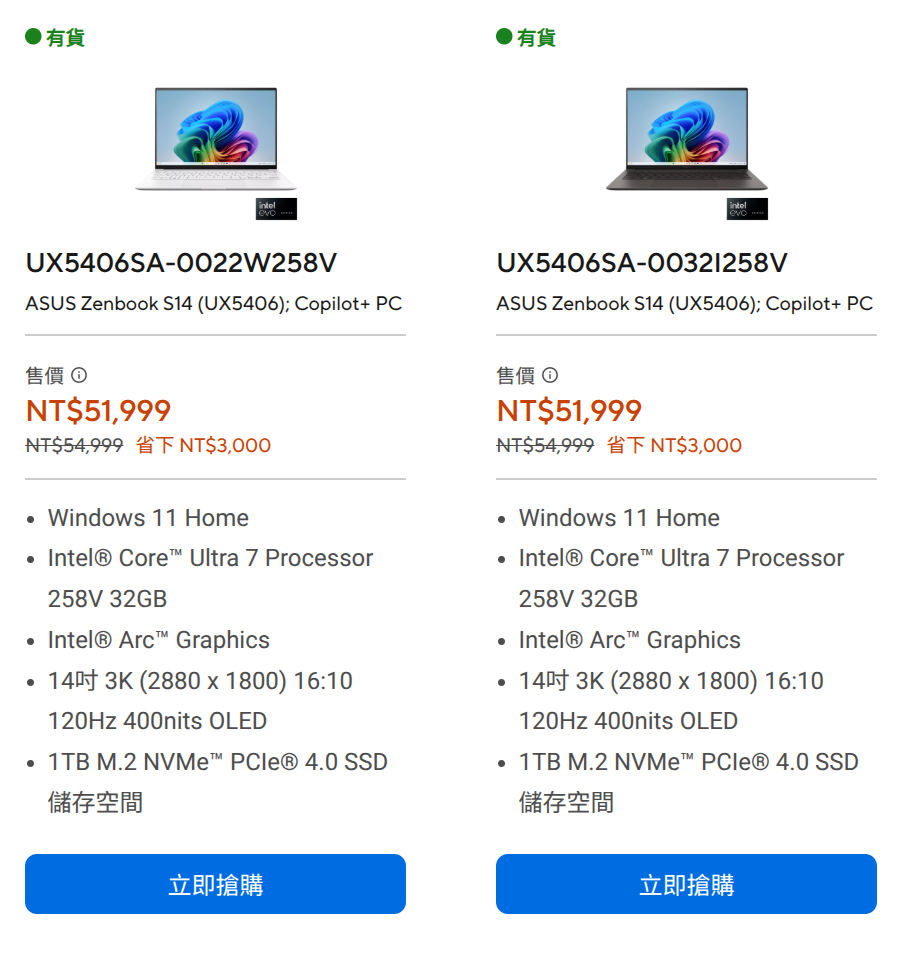
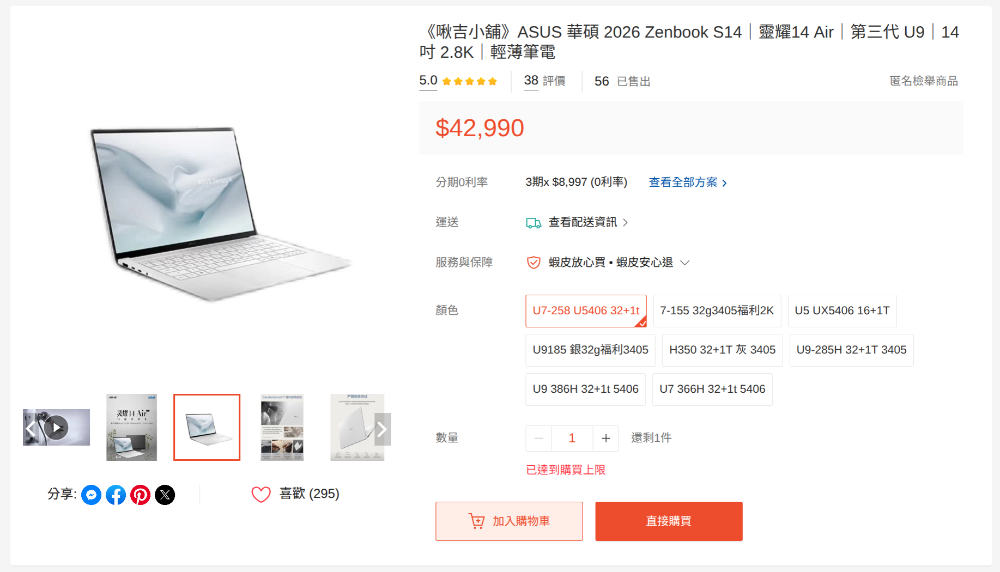
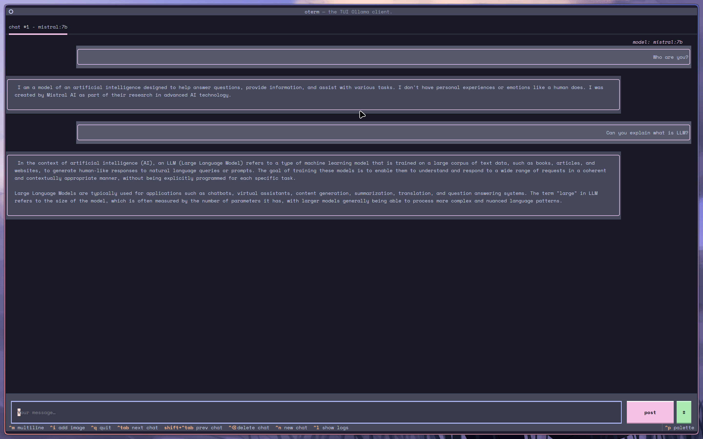

> TL;DR: it's thin and it's light. That's about it.

## Why get a new laptop?

Simply put, my old laptop's battery life was just terrible.

I bought my previous laptop during the COVID lockdowns for online classes. I remember laptop prices kept climbing and climbing back then, to the point where even integrated graphics laptops were going for 10k~20k TWD ~~though RAM prices seem to be doing the same thing right now~~. It was a Lenovo IdeaPad Gaming 3: AMD Ryzen 5 5600H, 8GB DDR4 RAM (later upgraded to 16GB myself), and an NVIDIA GTX 1650. A proper *gaming* laptop.

During online classes it was fine, since I was always plugged in at home. The GPU could handle most games and everyday use, so I was basically using a laptop as a desktop.

But once COVID ended and I started going out more, battery life became a real concern. That laptop could barely last 2–3 hours, which was **incredibly** annoying for someone who occasionally takes their laptop out.

The battery was around 45Wh, multiplied by the degraded capacity of roughly 83%, gives 37.35Wh. Divide that by a typical draw of ~15W, and you get about 2.5 hours — and that's without the GPU. Fire up the GPU and power draw can go up to 30W, making the battery life even worse.

On top of that, I got accepted through a special admissions process, and figured I'd need a new laptop for university anyway. So it was time for an upgrade.

## So, what laptop should I get?

Unlike before where gaming was a priority, my requirements now look roughly like this:

1. At least 4 hours of battery life without charging
2. Able to avoid using Windows
3. Good speakers and a nice looking chassis

If you took these requirements to basically anyone, about 95% of people would tell you to get a MacBook Air. You can grab one for around 30k TWD these days, the Apple M-series chips have incredibly low power consumption, the battery life is great, the design looks nice, and there's macOS to boot... right?

### Nah, no macOS :(

As much as I'd like to use macOS, I genuinely have no interest in Apple's ecosystem. Their software and services hold zero appeal to me — if anything, they kind of put me off. So a MacBook Air is a no from me, even though it checks almost every other box.

> I want a laptop with MacBook hardware running Linux

macOS issues include but are not limited to:

- Developers seemingly love locking features behind a paywall for some reason
- Limited customization, almost everyone got the same desktop layout
- ***Liquid Glass is so ugly***

## What Windows laptop then?

With MacBook ruled out and my requirements in mind, I started hunting for Windows laptops, mainly thin-and-light business ultrabooks, since they usually have better battery life and nicer chassis. As long as you don't accidentally grab one with an Arm processor, Linux should be installable.

After searching around, I came across the Zenbook S14. The top-spec configuration almost perfectly matched what I was looking for:

- Intel Ultra 7 258V
- 14-inch 16:10 OLED 120Hz display
- 32GB RAM
- 1TB PCIe 4 SSD
- Aluminum chassis

Most importantly, it has a massive 72Wh battery! I had a chance to try my friend's S16 and the speakers were pretty good on that, the S14's speakers probably won't be quite as good, but they shouldn't be bad either.

The downside? This:

> *Image shows the price of Zenbook S14 at the price of 51,999 TWD*

> This is the post-2026 price hike. It was originally around 49,900 TWD, so roughly in the 49k range.

At that price, you could just go buy a pretty nice MacBook Air. Yeah.

## Hello there overseas market

A friend recommended a China laptop reseller, with pricing that looked roughly like this:

It's still a bit pricey compared to the official price, but I told myself "I've been wanting this laptop for a long time, and now I finally have the chance", and somehow *accidentally* placed the order.

> The reason I didn't just buy directly from JD.com is that going through a reseller means there's someone to contact if something goes wrong, plus I hadn't used JD at the time.

After placing the order and waiting around, the seller said it was ready about two weeks later. We arranged an in-person meetup, and the moment I got my hands on it I couldn't wait to unbox it. The design looks... just great, the chassis is super thin, it feels light in hand, the screen is bright, and the speakers sound good. First impressions were excellent.

> That said, after using it for a bit I noticed the headphone jack looked like it had taken a knock, and there was some minor coating flaking on the lid though not super obvious, but a little disappointing. The seller did issue a partial refund though, and when I later brought it to ASUS for an ambient light sensor repair, they also cleaned up those minor cosmetic issues.

> Btw, ASUS warranty is surprisingly great, overseas market units can still use the global warranty.

## Windows to Linux

The laptop came with Windows 11. I used it for about 3 hours before starting to install Linux. What's different this time is that instead of going bare Arch, I went with CachyOS, an Arch-based distro. The installation process was dead simple with almost no issues. After getting it set up, things were mostly smooth, the only headaches were some ASUS-specific driver quirks. Here are a few issues I ran into:

### Ambient light sensor not detected

The display on this laptop has an ambient light sensor that's supposed to automatically adjust screen brightness and color based on the environment. On Linux, this feature simply doesn't work. I initially thought it was a driver issue, booted back into Windows to poke around, dug up SensorsExplorer, and still couldn't read anything.

I eventually sent it to ASUS for repair. They said it was fixed, but it turned out Windows worked fine while Linux still couldn't read it. That's when I figured out this laptop's sensor requires a separate Intel SensorHub driver. [Someone out there](https://github.com/dantmnf/zenbook-s14-linux) has already extracted the `.bin` file — drop it into `/usr/lib/firmware/intel/ish/` and reboot, and the ambient light sensor IIO device shows up.

### Speakers sound terrible

The speakers sound pretty decent under Windows, but on Linux, without ASUS and Dolby's EQ and DSP tuning, the audio becomes incredibly flat and thin. The bass completely vanishes.

The fix was to install [Easy Effects](https://github.com/wwmm/easyeffects) and fight with the EQ until I got the bass back. It still doesn't sound as good as Windows, but at least it's not terrible anymore.

> Side note: the Easy Effects author apparently had some kind of awakening, announced they hate GTK, and everything from version 8.x.x onwards is now Qt. The UI became incredibly ugly.

> Also, on older kernels this laptop might not have module support yet, but installing `sof-firmware` should fix the no-audio issue.

### Power limiting with TLP

I've had a habit since my old laptop of lowering platform power limits and changing the CPU scaling governor while on battery to extend runtime. On the old Ryzen 5 5600H, heavy underclocking caused very noticeable lag. On this Zenbook S14 though, the performance after limiting power is still really solid — barely any stuttering at all. In fact, even on more CPU-heavy tasks, the throttled performance still beats my old laptop by a good margin.

My guess is the 258V is just efficient enough that limiting it doesn't make much difference. Temperatures hover around 45°C or so.

## After using it for a while

The most obvious thing after extended use is that the battery life genuinely holds up. It doesn't match the latest MacBook, but it beats roughly 80% of Windows laptops on the market. Charged to 100%, I get around 5 ~ 7 hours of mixed YouTube and coding. Pure coding + Spotify + Discord + browser should stretch to about 5 hours.

It's still an amd64 chip from Intel, so heat output is still a thing. On battery it's fine, but once you plug in, the scaling governor kicks into performance mode, the CPU decides to get busy for nothing, and temperatures sometimes creep into the 50°C range.

### Running some games

For gaming, I tested running Zenless Zone Zero on Linux through some *creative methods*, the Arc 140V integrated graphics can hit around 40–50 FPS at medium settings, which is playable. Another popular game this month called Arknight: Endfield completely fell apart though, barely hitting 10 FPS even at the lowest settings under Windows.

All in all, this is not a gaming laptop.

### Local LLM!

No dedicated GPU and not a gaming laptop, but the integrated graphics actually seem well-suited for running local LLMs. I used the [intelanalytics/ipex-llm-inference-cpp-xpu](https://hub.docker.com/r/intelanalytics/ipex-llm-inference-cpp-xpu) Docker image to run Ollama.

> The reason I didn't just run Ollama directly is that Intel's native support is pretty rough — I couldn't get it to use the GPU or even the NPU no matter what I tried. This Docker image turned out to be the most convenient and stable approach.
>
> If you don't want to use the Docker image, [LM Studio](https://lmstudio.ai) is another option, it can use Vulkan to offload to the GPU, but the performance isn't as good as the SYCL backend the Docker image uses.

I grabbed the Ollama client `oterm` to interact with it, and it looks something like this:

I didn't benchmark tokens per second, but the initial speed felt comparable to ChatGPT. It does slow down over time though.

> As for the NPU that this CPU supposedly has built-in, I still have no idea how to use it, and I've heard it might only be supported on Windows right now.

## Conclusion

Not much else to say — it's a thin-and-light business ultrabook. Good battery life, nice design, Linux works on it. The main downside is the price, which is a bit steep. But if you're in the market for a thin-and-light business laptop, the Zenbook S14 is definitely worth considering.
