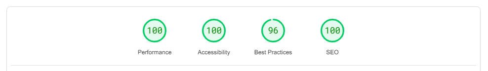
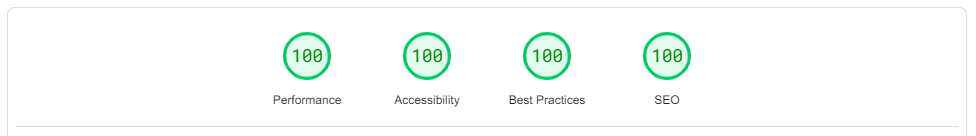

事情發生在某天我想開始建立個人網站的時候，我當時正在思考有什麼方法可以讓我快速的建立一個網站

使用現有的模版當然可以，但我不希望我的網站跟別人的看起來很像。只用 HTML 開搞當然也是可以，但我可不希望處理網頁的效能，想到未來的可維護性更是頭痛。

## 框架？

考慮以上幾點，我似乎需要一個網頁框架來幫助我處理這些問題。經過我生鏽的大腦考慮後，我整理出了以下幾個框架：

### Next.js

第一個參賽者是 Next.js，一個建立全端網頁時最好的選擇

憑藉著 React 的生態系，Next.js 在我心中有了近乎完美的分數。這就是為什麼這個框架是我建立網站第一個考慮的框架。

但是好的東西總是有著缺點。例如在不用 SSR (server-side rendering) 的情況下，網頁是不能在 JavaScript 停用的狀況下瀏覽的、Next.js 與 React 的在網頁裡包含的函式庫跟純 HTML 比起來大多了，會稍稍拖慢網站的效能。

### Vue.js

既然都叫 Vue".js" 了，怎麼可能不用 JavaScript？而且 Vue 的語法對我來說有點不合胃口，`<script setup>`，看起來好奇怪...

### Angular... 等等這個真的有人用嗎？

哎呀 Angular，好久不見。Angular 以前似乎在前端設計頗有名聲，但我不太確定現在的評價如何。

於是我決定到 Angular 的網站看看，但這個看起來有些奇怪的程式碼讓我卻步了：

```ts
import {Component} from '@angular/core';
import {FormsModule} from '@angular/forms';
import {bootstrapApplication} from '@angular/platform-browser';

@Component({
  selector: 'app-root',
  standalone: true,
  template: `
    <label for="name">Name:</label>
    <input type="text" id="name" [(ngModel)]="name" placeholder="Enter a name here" />
    <hr />
    <h1>Hello {{ name }}!</h1>
  `,
  imports: [FormsModule],
})
export class DemoComponent {
  name = '';
}

bootstrapApplication(DemoComponent);
```

不知道你們怎麼想，但我個人覺得它比 Vue 還要難看

### Astro

後來，我找到了 Astro。一些 Reddit 的使用者都蠻推薦這個新的網頁框架。於是我開了 Astro 的網站來看看，這裡是一個範例程式碼中的首頁範例：

```astro
---
import '../styles/global.css';
// Component Imports
import Button from '../components/Button.astro';

// Full Astro Component Syntax:
// https://docs.astro.build/basics/astro-components/
---

<html lang="en">
	<head>
		<meta charset="utf-8" />
		<meta name="viewport" content="width=device-width" />
		<link rel="icon" type="image/svg+xml" href="/favicon.svg" />
		<meta name="generator" content={Astro.generator} />
		<title>Astro + TailwindCSS</title>
	</head>

	<body>
		<div class="grid place-items-center h-screen content-center">
			<Button>Tailwind Button in Astro!</Button>
			<a href="/markdown-page" class="p-4 underline">Markdown is also supported...</a>
		</div>
	</body>
</html>
```

嘿等等，我是在看 HTML 還是一個網頁框架的語法？這個看起來極其簡單的語法讓我馬上想試試看這個酷酷的框架。

> 稍稍停一下，為什麼我覺得沒有開 JavaScript 的使用者很重要？
>
> 首先，通常以 JavaScript 來渲染的網頁都使用較多的資源，也可能拖慢網站速度。還有，有著更高安全性的瀏覽器（例如 Tor 瀏覽器）時常預設將 JavaScript 封鎖。
>
> 我希望我的網站是大家都可以輕易的瀏覽，包含那些沒有穩定的網路或是使用舊手機的人
>
> 我也希望可以使我的網站對盲人"聽起來更好聽"，我還在持續加強這塊

## 開搞 Astro 網頁

在決定成為一個太空人 （用 Astro 的人叫 Astronaut，個人覺得這個名字很酷 :D）之後，我使用了這個指令來開一個新的專案：

```bash
pnpm create astro@latest
```

接著把 TailwindCSS 新增到 Astro 內：

```bash
pnpm astro add tailwind
```

> 嘿，TailwindCSS 版本 4 有更改使用方式，我目前不確定現在這個指令會產生什麼樣的結果。你可能需要看一下 Astro 跟 TailwindCSS 的說明文件

然後我就開始寫網站了。Astro 直覺的語法十分好理解，特別是如果你以前有學習過 HTML。Astro 的 Island 也讓框架混搭變得簡單許多，如果你現在有使用其他框架撰寫的程式碼也可直接用上。

## 太空人的煩惱

### 傳說中的 JavaScript

Astro 預設不放任何 JavaScript 到你的網頁中，這使 Astro 在撰寫互動式網頁時比較不那麼理想。以狀態管理來說，Astro 就沒有像 React 一樣的小工具可以使用。我們以此網站的狀態列為例：

這是如果我使用 React 的話看起來的樣子：

```ts
const [scroll, setScroll] = useState(false);

window.addEventListener("scroll", (event) => {
  // 一些判斷條件
  setScroll(true);
});

return (
  <nav class={twMerge("some-default-style", scroll && "some-special-style")}>
    {/* ...其他程式... */}
  </nav>
);
```

那如果我使用 Astro，一個幾乎不對 JavaScript 做任何更改的網頁框架呢？

```astro
<nav class="some-default-style" id="nav">
  {/* ...其他程式... */}
</nav>

<script>
  window.addEventListener("scroll", (event) => {
    // 一些判斷條件
    document.getElementById("nav").classList.add("special-style");
    // else
    document.getElementById("nav").classList.remove("special-style");
  }
</script>
```

剛開始，你可能會覺得框架不使用過多 JavaScript 感到開心，因為它不像 React 會限制你只能使用特殊語法或是只能使用特定的實作方式，但隨著你的網站需要的動畫增加後，你會需要自己寫更複雜的程式碼來製作這些動畫。這使 Astro 在撰寫互動式網站時不那麼的方便。

### 圖片優化

Astro 內建的 `astro:assets` 模組提供了**一些**圖片優化，像是圖片壓縮跟可以使其更無障礙的標籤等等。

但是 Astro 的圖片優化沒有提供一個我希望有的功能：對於不同的螢幕尺寸來給予不同的 `src`，也就是 `srcset`。需要額外撰寫一個酷酷的 `OptimizePicture` 元件來為圖片產生多個 `widths` 屬性，一個 `astro:assets` 內 `Image` 所支援的屬性，你可以看看 [Astro 對於這個屬性的說明文件](https://docs.astro.build/en/reference/modules/astro-assets/#widths)

底下是我的 `OptimizePicture` 元件的程式碼，供你參考一下

```astro
---
import { Picture, inferRemoteSize } from "astro:assets";

const props = Astro.props;

let width;
if (typeof props.src === "object") {
  width = parseInt(props.src.width);
} else if (typeof props.src === "string") {
  const size = await inferRemoteSize(props.src);
  width = size.width;
}

const widths = [];
const ratioMultiplier = props.maxWidth / props.maxViewport;
let currentViewport = props.maxViewport;

while (currentViewport >= 240) {
  widths.push({
    viewport: currentViewport,
    width: Math.round(currentViewport * ratioMultiplier),
  });
  currentViewport -= 320;
}
---

<Picture
  formats={["avif"]}
  widths={widths.map(({ width }) => width)}
  sizes={widths
    .reverse()
    .map(
      ({ viewport, width }) =>
        `(max-width: ${viewport}px) ${width}px`,
    )
    .concat(`${width}px`)
    .join(", ")
    .trim()}
  quality={100}
  {...props}
>
  <slot />
</Picture>
```

在我撰寫這個元件時，我發現 Astro 似乎沒有一個標準載入圖片的方式。`props.src` 回傳的內容有時是 `string`（字串），而有時是 `object` （物件）。這個元件只能支援 `props.src` 為物件的時候，也就是在 Markdown 檔案裡載入圖片的時候。

> 嗨，如果你覺得你有更好的解法，請發一個 email 讓我知道！

## 結論

在閱讀完這個文章後，你可能會想，你真的需要使用 Astro 嗎？

我的想法是，如果你要建立一個靜態網站、個人的部落格或是不會使用到那麼多很 fancy 的 JavaScript 技術，我建議你使用 Astro。畢竟，[這個分數很高對吧](https://pagespeed.web.dev/analysis/https-wolf-yuan-dev/xm8wfbsjxw)：

> 2025/06/22 更新：PageSpeed Insights 好像不會保留網站測試的歷史紀錄，你可以自己去 [PageSpeed Insights 的網頁](https://pagespeed.web.dev/) 把我的網站丟進去測測看




但是若你的網站需要更多需要 JavaScript 來達成的效果，不論是動畫還是功能，我還是建議你使用其他框架。
