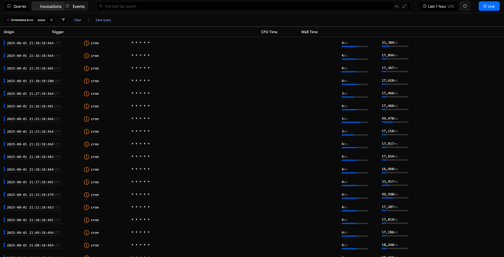

> [直接帶我去查 Bike 網頁](https://youbike.wolf-yuan.dev/)
>
> *專案與 YouBike 完全無關*

最近真的一直被 YouBike 氣到。

理論上來說，YouBike 應該要確保任何一個站點沒有車可借，更不應該讓有任何一站沒有位子可以還車。但好像 YouBike 官方基本上沒有很常在管這件事情

經過幾次從高中出來沒有車可借，或是騎到目的地之後沒有位可還，客服電話已經打到感覺行動電話的市話有點貴後，我想寫一個小程式看看 YouBike 到底有沒有在沒車的時候即時補車，或是在一天某個時段都會沒車的時候，YouBike 有沒有預防性的先補車

## 查 Bike

經過大約 25 小時的瘋狂 coding 跟抓 bug，還有幾天的資料收集後，我搞出了這個網站：

你現在也可以上 https://youbike.wolf-yuan.dev 來看看這個網站

### 超簡單的首頁

首頁上可以看到系統總共追蹤的站點有幾個，而整體來看，累積多少時間沒有車可以借、沒有位可以還

另外，最頂部的表情跟底下的文字會依照全部已追蹤站點的狀態顯示

在首頁上面，這幾個表情符號分別代表：

- 綠色笑臉：全部的站點都**有車可以借，有位可以還**
- 黃色哭臉：有站點**沒有位子可以還了**
- 紅色生氣：有站點**沒有車可以借**

而每個站點也都可以展開顯示近幾個小時的歷史紀錄，還有該站點有多少百分比的時間沒有車可以借或是位可以還

### 算詳細的站點報告

在首頁點下去「查看更多歷史資料」的按鈕後，會跑出這個頁面：

這個頁面可以查詢**最多 5 天內的各小時**站點狀態快照還有**即時的站點狀態**，旁邊有一個小小的狀態條會顯示那個時候的站點狀態

哦對了，每小時快照狀態條的顏色跟首頁的狀態顏色意義意義，也是黃色是沒位可還，紅色是沒車可借

但是這個表情符號的顏色跟就跟首頁稍稍不太一樣了。為了讓別人看這個頁面可以直接知道現在的狀態，各個顏色代表：

- 紅色：**已經全部**沒車可借或是沒車可還
- 黃色：**\<5 臺**車可借 或是 **\<3 個**還車柱可還
- 綠色：就完全正常，可借可還

> 可能會改，但目前我認為這樣比較可以一下子就知道有沒有車可以借

### 怎麼加站點？

啊當然現在寫了一長串好用的功能，你可能會想問你要怎麼把站點加進追蹤清單內

因為目前這個網頁還不太穩定，站點現在採申請制。如果你想要把你家附近的站點或是學校附近的站點加到這個網頁裡面，你可以發一個郵件到 [me@wolf-yuan.dev](mailto:me@wolf-yuan.dev?subject=%E6%9F%A5%20Bike%20%E7%AB%99%E9%BB%9E%E7%94%B3%E8%AB%8B)

郵件內容必須包含以下幾個東西：

1. 要加站點的**完整站點名稱**
   > 不知道可以看停車柱上面的站點名字，或是上 YouBike 官網查詢。得是完整的站點名稱
   > 站點名稱得讓我知道的你的站點到底是哪個，如果還是真的不確定到底叫做什麼，你可以丟地址給我。記得檢查有沒有其他站點撞名哦
2. 一張或是多張 **站點沒車** 或是 **站點滿車然後你沒位子可以還的照片**
   > 如果沒有照片，你可以寫一小段為什麼要加的理由

伺服器與資料庫資源有限（目前是很有限），目前還沒辦法全台的站點都加進去，所以目前得先這樣處理

## Well, technically 🤓☝️

講完功能之後，該來講講這個網頁背後用的技術。這個網站目前現在整個活在雲端，也不花我一毛錢

> 應該是說以目前的規模來說不用花我一毛錢，請各位爬蟲們高抬貴手，我未來可能會加 API

### 拉資料的後端（應該算後端

後端採 **TypeScript** 撰寫，跑在 **Cloudflare Workers** 上面會從 YouBike 的網頁 API 抓完資料後，放進 **Supabase** 資料庫

資料類型分成兩種，兩個都用 **cron trigger** 跑：

- 每分鐘即時資料 `* * * * *`：抓即時資料，看站點狀態來增加沒車 / 滿車的時數
- 每小時資料快照 `0 * * * *`：抓資料放站點快照，就這樣

每個小時的快照僅會保存 5 天，但每分鐘的沒車 / 滿車狀態則是累加，無天數限制

### 顯示資料的前端（網頁

前端用 **Astro** + **TypeScript** + **TailwindCSS** 撰寫，跑在 **Cloudflare Workers** 上

每個頁面都是用 SSR (Server side rendering)，也就是每個頁面都不需要 client 額外去叫 Supabase 的 API，理論上會讓效能變好很多，特別是在效能超級糟糕的中低階手機上。網頁設計採用跟我個人網站一樣的設計語言

頁面跟頁面之間都用 Astro 的 `<ClientRouter />` 串起來，用瀏覽器的 [View Transition API](https://developer.mozilla.org/en-US/docs/Web/API/View_Transition_API) 做出頁面跟頁面之間超級流暢的動畫

> 我很抱歉 Firefox 使用者，Firefox 現在沒有 View Transition API 所以只會看到淡入淡出

### YouBike 的伺服器是馬鈴薯做的

另外，吐槽一下 YouBike

後端在抓資料的時候，時不時就會抓到 YouBike 伺服器噴出來的 503，不知道是刻意的還是伺服器後端程式寫太爛，但每次都是在深夜出現

目前推測是 YouBike 為了省錢，在夜晚的時候 scale-down 伺服器或是 DB 的 replica 變少，讓錯誤率提高

## 資料得出的結論

所以我看了這些資料得出來的結論是什麼？

我只能說，YouBike 是可以解決這些沒車、沒位還的問題，我也認為他們有想要解決，只是要再多加把勁

根據 [臺北市提供的見車率](https://data.taipei/dataset/detail?id=ba0dafae-043c-4730-b97e-2defd7af766c) 資料顯示，臺北差不多有 700 多個站點見車率大於 90%，500 多個站點見車率介於 60% ~ 90% 之間

經過比對，在臺北的站點跟系統蒐集到的資料大略相同，但因為那些小站或是流動率較低的站點，卻可以讓 [見車率的統計數據](https://www.traffic.ntpc.gov.tw/home.jsp?id=54fa46e9e522dde4&act=be4f48068b2b0031&dataserno=c45bbd64880bc80ae4633331e8262fde&mserno=39e5192ff77897e0ae099c1886ca9b09) 提高。我不曉得見車率 93% 怎麼算來的，但對於尖峰時段會沒車的站點來說，見車率絕非 93%

而聯絡客服後，補車人員差不多要 15 分鐘左右才會到場補車，如果現場沒車預備則會需要更多的時間，客服會先叫你去鄰近站點借車還車。臺北新北人可能還有捷運可以使用，對於其他縣市來說，下個站點可能距離超級遠，要走過去倒不如直接用其他交通方式

然後現在 YouBike 直接把客服專線裡面的無車可借的選項拿掉，真有你的 YouBike
