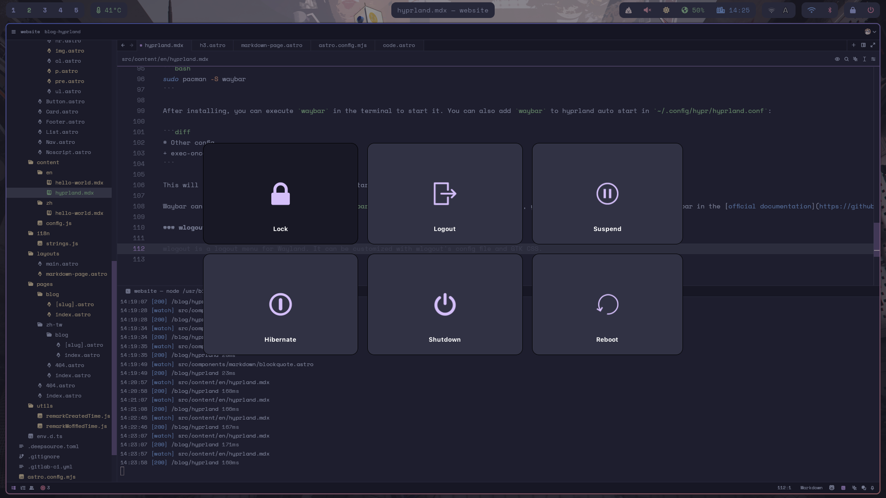

事情從某個晴朗的下午說起，當時我正無聊著瀏覽著網站，驟然發現數則令人在意的新聞，有關一個新的視窗管理系統 hyprland 。連結到我之前在Reddit上看到的貼文，展示著許多近乎完美的桌面設置，簡潔而不像傳統的桌面環境如 Gnoem 或是 KDE 。感到十分好奇的我便開始更加深入的瞭解，看過一些文章及影片後，我決定嘗試看看這個酷東西。以下我將分享我如在我的電腦上安裝及設定 hyprland ，對了，它現在看起來像這樣。


## 安裝

安裝 hyprland 非常簡單且快速。首先，你得在你的電腦上安裝 Arch Linux ，但注意，不要安裝桌面環境。完成後，執行以下指令：


```bash
sudo pacman -S hyprland
```

同時你需要 hyprland 預設的虛擬終端機環境 kitty ，使用下列指令安裝。


```bash
sudo pacman -S kitty
```

很簡單對吧。雖然使用 Arch 分支的其他 Linux 發行版如 Manjory 或 EndeavourOS 能然能執行 hyprland ，但我高度推薦使用 Arch Linux 。


> 這份教學假設您使用 Arch Linux 。不推薦使用 Debian 或是 Fedora ，他們的更新速度不像 Arch Linux 那麼頻繁和及時。時它們的可能不支援許多 hyprland 必須或額外的元件，您可能得**自行撰寫或編譯**它們。

如果您不想要每次開機都得手動輸入以進入 hyprland ，我會推薦你安裝 ssdm 登入管理員，它兼具簡單及高度客製化的優點，您可以執行以下指令安裝 ssdm : 

```bash
sudo pacman -S sddm
```

接著只要重新啟動電腦，您就會發現 hyprland 已經成功的安裝了。

## 客製化

當然，您會發現目前的 hyprland 與美麗二字相差甚遠，這是因為 hyprland 預設的自動生成設置檔僅有最基礎，最低限度的設置，進階的功能必須由您手動設置。以下是幾項初始 hyprland 不具備的功能


- 亮度調節
- 音量調節
- 螢幕截圖或錄影
- 螢幕鎖定

沒錯，hyprland 就是這麼的*高度客製化*，多數的設置都得由您親手完成，聽起來多麼的令人興奮阿！


舉例來說，若我們想把上方橫欄中討人厭的自動生成警告移除，可以開啟 `~/.config/hypr/hyprland.conf`, 註解以 `autogenerated` 為首的整行程式:

```ini
# #######################################################################################
# AUTOGENERATED HYPR CONFIG.
# PLEASE USE THE CONFIG PROVIDED IN THE GIT REPO /examples/hypr.conf AND EDIT IT,
# OR EDIT THIS ONE ACCORDING TO THE WIKI INSTRUCTIONS.
# #######################################################################################

autogenerated = 1 # remove this line to remove the warning // [!code focus] // [!code --]
# autogenerated = 1 # remove this line to remove the warning // [!code focus]
```

更改完畢後別忘了儲存檔案， hyprland 在檔案變更後會自動重新載入設置檔。如果您想要手動重載，可以使用 `hyprctl reload` 指令。

如果需要更多的客製化設置，您可以在 hyprland 的[官方維基](https://wiki.hyprland.org/Configuring/Variables/)上找到所有可供設定的選項.


## 為 hyprland 加上酷酷的模組

初始的 hyprland 並未具有許多其他視窗管理系統擁有的特色，但透過手動安裝額外的擴充軟體仍然可以擁有外加的功能。

以下我將會介紹幾種我自己有在使用的擴充，讓 hyprland 更加方便實用(同時也更美麗): 


### waybar

[waybar](https://github.com/Alexays/Waybar) 是為 Wayland 量身定做的狀態列擴充，使用 waybar 的設置檔加上 GTK CSS 可以達成高度客製化.


使用以下指令安裝 waybar :

```bash
sudo pacman -S waybar
```

安裝後您可以手動在終端機執行 `waybar` 來開啟狀態列，也可以直接修改位於 `~/.config/hypr/hyprland.conf` 的 hyprland 設置檔，在任意位置加入以下的程式碼 :

```diff
# Other config ...
+ exec-once = waybar
```

這會讓 hyprland 在啟動時自動幫您執行 `waybar`。

waybar 的設置檔位於 `~/.config/waybar/config` 以及 `~/.config/waybar/style.css` ，你可以在 waybar 的[官方文檔](https://github.com/Alexays/Waybar/wiki)找到更多的資訊。

### wlogout

[wlogout](https://github.com/ArtsyMacaw/wlogout) 是一款適用於 wayland 協議的登出選單，可以用來將電腦登出、重啟、關機或是將螢幕鎖定。



使用下列指令安裝 wlogout :

```bash
paru -S wlogout
```

> `wlogout` 被儲存於 AUR ( Arch 使用者軟體庫 ) 中，因此您可以將 `paru` 置換成 `yay` 或是任何您熟悉的 AUR 助手。

wlogout 擁有許多可供客製化的選想，編輯位於 `~/.config/wlogout/layout` 及 `~./config/wlogout/style.css` 的設置檔進行手動設置。可以使用 `man` 指令檢查一下: 


```bash
man 5 wlogout
```

不像 `waybar` 必須於 hyprland 啟動時就開始執行，`wlogout` 可以綁定快捷鍵以在任何時候開啟:


```diff
+ bind = SUPER, P, exec, wlogout
```

這可以讓您按下 `SUPER(通常指 windows 鍵) + P` 的組合鍵後開啟 `wlogout`。

### wofi

> 注意！ wofi 似乎已經不在被積極維護，但他在我的筆電仍然可以運行。如果您會介意，可以尋找 [fuzzel](https://codeberg.org/dnkl/fuzzel) 或 [rofi](https://github.com/davatorium/rofi) 等類似的擴充進行替代


[wofi](https://sr.ht/~scoopta/wofi/) 是適用於 wayland 的應用程式起動器及選單，它同樣支援 GTK CSS 用以客製化。


使用以下指令安裝 wofi :

```bash
sudo pacman -S wofi
```

在終端機中輸入 wofi 以啟動。當然您也可以在 `~/.config/hypr/hyprland.conf` 中將 `wofi --show durn` 綁定快捷鍵，

``` ini
bind = SUPER, D, exec, wofi --show drun
bind = SUPER, D, exec, wofi --show drun
```

> 若想顯示應用程式圖標，可以將 `--allow-images` 加入命令列選項中。

### SwayOSD

[SwayOSD](https://github.com/ErikReider/SwayOSD) 是一個酷酷的螢幕顯示軟體，可以顯示亮度或音量的狀態及改變，也可以呈現大小寫鎖定或是數字鍵鎖定的狀態。

使用以下指令安裝 SwayOSD:

```bash
paru -S swayosd-git
```

> `swayosd-git` 被儲存於 AUR ( Arch 使用者軟體庫 ) 中，因此您可以將 `paru` 置換成 `yay` 或是任何您熟悉的 AUR 助手。

## 我的 dot files

包含我數個 dot files 的 GitLab 庫存，以及我的 hyprland 設定檔。你可以點擊[這裡](https://gitlab.com/wolf-yuan/dotfiles)以查看。
